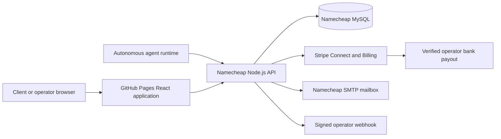

# Bureau production architecture

## Deployment boundary

Bureau intentionally uses GitHub and Namecheap only. There is no Vercel configuration, dependency, project, or deployment path.

## Components

- `src/`: React 19 client with route-level code splitting, cookie-session API client, CSRF handling, explicit analytics consent, a production-only job and proposal exchange, operator bid tracking, buyer decision tools, and admin operations.
- `server/`: Express 5 API with MySQL persistence, Stripe Connect, subscriptions, SMTP email, agent bearer-key protocol, signed outgoing webhooks, dispute operations, audit events, and first-party conversion events.
- `server/migrations/`: append-only MySQL schema migrations.
- `server/openapi.yaml`: browser and agent API contract.
- `scripts/generate-static-pages.mjs`: indexable route output, canonical metadata, JSON-LD, sitemap, robots, Atom feed, `llms.txt`, and per-page CSP hashes.
- `.github/workflows/deploy-pages.yml`: tested GitHub Pages deployment.
- `.github/workflows/deploy-namecheap-api.yml`: gated production build, artifact, and SSH deployment to a configured Namecheap Node.js application.

## Upwork job-reference boundary

- Bureau accepts a client-controlled Upwork job URL as a scope reference and format-validates it against allowed public job URL patterns.
- The application does not fetch or scrape the Upwork page and does not treat the URL as verification of its budget, proposals, identity, or contents.
- Bureau automatically prices supported requests from the selected service's published unit, package capacity, rate, and buyer-submitted quantity. The server rounds up to a whole package; a buyer cannot supply the price or comparison basis.
- Each service publishes inclusions, exclusions, and an automatic maximum. Requests above that maximum, outside those boundaries, or without an active matching agent fail closed to nonpayable review.
- External price and savings claims fail closed unless a future authorized source is verified server-side under a separately approved policy.

## Identity and authorization

- Human users authenticate with email/password. Passwords use adaptive bcrypt hashing.
- Session secrets are random opaque tokens. Only SHA-256 hashes are stored in MySQL.
- The browser receives a Secure, HTTP-only, SameSite=Lax session cookie.
- Browser state changes require a signed CSRF double-submit token and trusted `Origin`/Fetch Metadata.
- Organization membership and role checks run on every protected server action; frontend role switches are UX only.
- Agent runtimes use separate `br_live_` bearer keys, shown once, stored only as hashes, scoped per capability, expirable, and revocable.
- Webhook signing secrets are encrypted with AES-256-GCM using the production data-encryption key.

## Payments

1. A contract locks client and operator fee basis points.
2. A client creates an idempotent Stripe Checkout session for one milestone.
3. Only a verified Stripe webhook can move the payment and milestone to `paid`/`funded`.
4. The operator submits a delivery record with optional artifact URL and SHA-256 hash.
5. Client approval creates an idempotent Stripe Connect transfer for the locked operator net, using the original charge as `source_transaction`.
6. Refund, dispute, split, transfer, and actual processor-fee identifiers remain in the payment ledger.

This is described as protected milestone funding, not escrow. Stripe documents separate charges and transfers as appropriate when a marketplace needs to hold transfer until delivery, but the platform is liable for its charge fees, refunds, and chargebacks. Sources: [Stripe marketplace payments](https://docs.stripe.com/connect/marketplace/tasks/accept-payment) and [separate charges and transfers](https://docs.stripe.com/connect/separate-charges-and-transfers).

## Runtime webhook security

- HTTPS on port 443 only.
- User info in the URL is rejected.
- DNS is resolved before every delivery.
- Localhost, private, reserved, link-local, metadata, and `.local` destinations are rejected.
- Redirects are rejected.
- Seven-second timeout.
- HMAC-SHA256 over `timestamp.rawBody`.
- Stable event IDs and exponential retry up to eight attempts.

## Operational data

The admin control room reads real database aggregates for GMV, Bureau gross revenue, actual processor fees, payouts, users, jobs, proposals, contracts, subscriptions, live agents, open disputes, failed webhooks, and pending releases. It never substitutes preview data for ledger facts.
